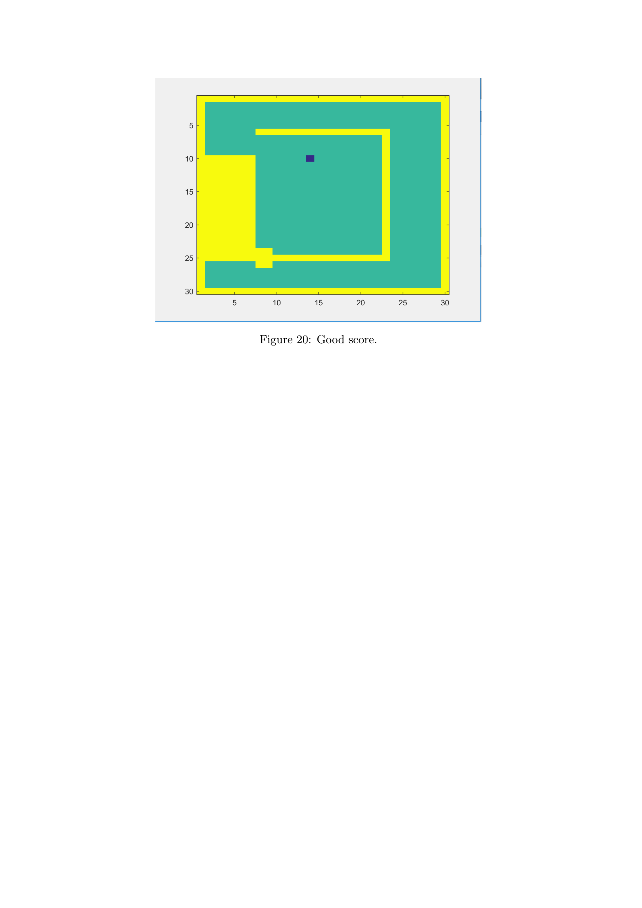

# Snake Game

In This project, we explored reinforcement learning for control and decision-making through the classic Snake game, with a strong emphasis on structured state–action representation. The core contribution is a feature extraction pipeline that transforms raw grid observations into meaningful, interpretable state–action features capturing goal proximity, collision risk, and long-term survivability. By explicitly modeling constraints such as walls, self-collisions, and trapped free space, the project studies how hand-engineered features influence policy learning, stability, and performance. Overall, it serves as a compact but rigorous testbed for understanding RL behavior in constrained environments and for bridging the gap between raw sensory input and effective action selection.

